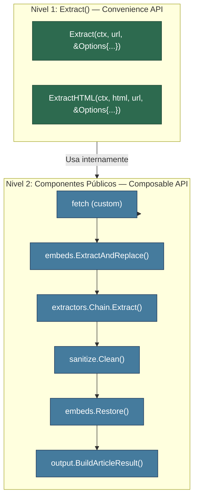
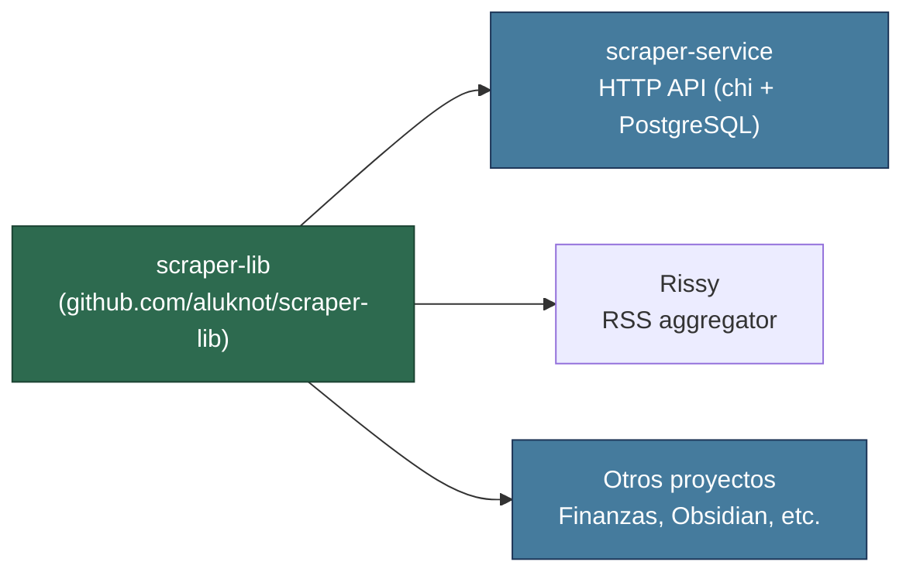
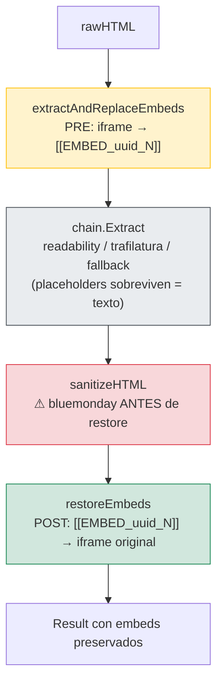
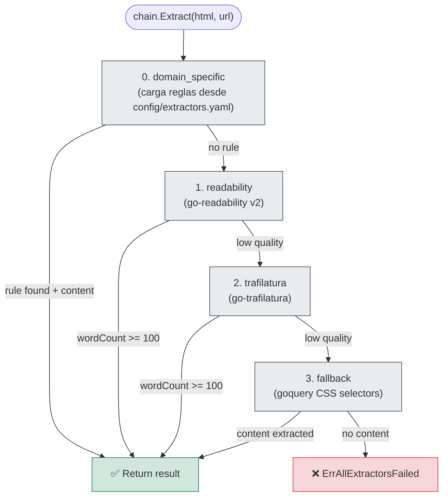
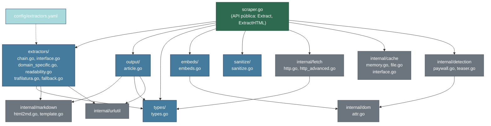
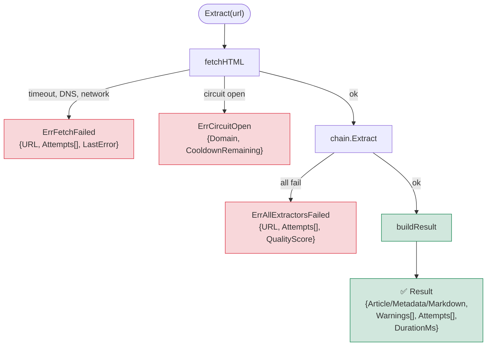

# Diagramas — scraper-lib v10.0

> Diagramas Mermaid renderizables en GitHub, Obsidian, VS Code preview.

---

## 1. API en Dos Niveles



### Paquetes Públicos

| Paquete | Componentes |
|---------|-------------|
| `extractors/` | `Chain`, `NewChain()`, `DefaultChain()`, `Extractor` interface |
| `output/` | `BuildArticleResult()`, `BuildMetadataResult()`, `BuildRawResult()`, `BuildMarkdownResult()` |
| `types/` | `ExtractResult`, `Attempt`, `StrategyAttempt`, `PriceInfo`, `JobInfo` |
| `embeds/` | `EmbedExtractor`, `NewEmbedExtractor()`, `ExtractAndReplace()`, `Restore()` |
| `sanitize/` | `Sanitizer`, `NewSanitizer()`, `Clean()` |

---

## 2. Arquitectura General



## 3. Pipeline `Extract()` con Stages Opcionales

```mermaid
flowchart TD
    Start(["Extract(url)"])

    Start --> C0["0. Check cache"]
    C0 -->|hit| RetC["Return cached ✅"]
    C0 -->|miss| S1["1. fetchHTML\n(con retry + exponential backoff)"]

    S1 -->|fail| Err1["ErrFetchFailed ❌"]
    S1 -->|ok| S2{"NoPaywallDetection?"}

    S2 -->|false (default)| S2A["2a. detectPaywall\n(marker, no bypass)"]
    S2A --> S3
    S2 -->|true| S3["3. extractAndReplaceEmbeds"]

    S3{"NoEmbeds?"}
    S3 -->|false (default)| S3A["3a. extractAndReplaceEmbeds\n(PRE: placeholders + embedMap)"]
    S3A --> S4
    S3 -->|true| S4["4. chain.Extract"]

    S4["4. chain.Extract\ndomain_specific → readability → trafilatura → fallback"]

    S4 -->|fail| Err5["ErrAllExtractorsFailed ❌"]
    S4 -->|ok| S6{"NoSanitize?"}

    S6 -->|false (default)| S6A["6a. sanitizeHTML\n(bluemonday UGCPolicy)"]
    S6A --> S7
    S6 -->|true| S7["7. restoreEmbeds"]

    S7{"NoEmbeds?"}
    S7 -->|false (default)| S7A["7a. restoreEmbeds\n(POST: iframes en posición original)"]
    S7A --> S9
    S7 -->|true| S9["9. buildResult"]

    S9["9. buildResult + cache store"] --> RetR["Return Result ✅"]

    classDef step fill:#e9ecef,stroke:#495057
    classDef opt fill:#fff3cd,stroke:#ffc107
    classDef error fill:#f8d7da,stroke:#dc3545,color:#721c24
    classDef success fill:#d1e7dd,stroke:#198754,color:#0f5132
    classDef pending fill:#a8dadc,stroke:#1d3557
    class S1,S2A,S3A,S4,S6A,S7A,S9,C0 step
    class S2,S3,S6,S7 opt
    class Err1,Err5 error
    class RetC,RetR success
```

> **Nota:** Stages 2, 3, 6, 7 son opcionales según las Options de Extract().

## 4. Embed Pre/Post Processor — Orden Crítico



## 5. Extractor Chain — Decision Tree



## 6. Package Dependency Graph (v10.0)



> **Leyenda:**
> - 🟢 **verde oscuro**: API raíz pública
> - 🟢 **verde azul**: Paquetes públicos exportados (usables por clientes)
> - ⚪ **gris**: Paquetes internos (implementación)

## 7. Error Types — Cuándo se generan



---

[Volver al índice](README.md)
